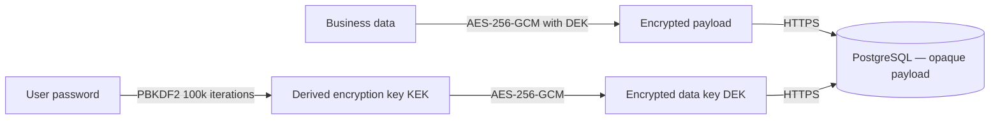
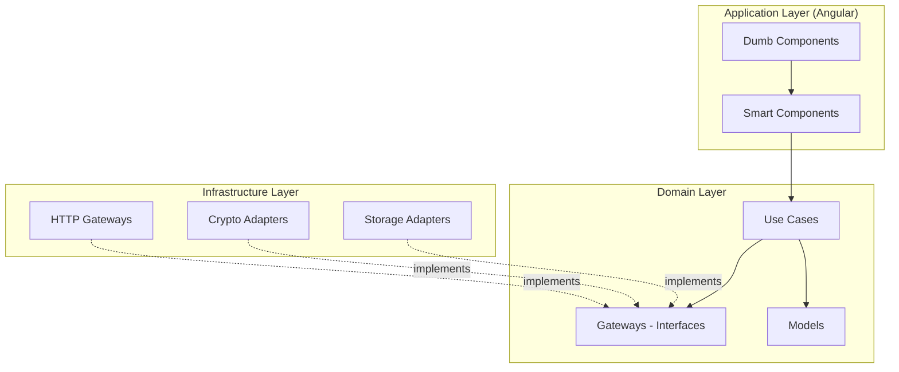

<div align="center">

[Français](./README.md) · **English**

# ⚡ DashFlow

### Personal **all-in-one** dashboard — family budget & medical tracking

**Self-hosted · End-to-end encrypted · Zero third-party cloud**

[](https://angular.dev)
[](https://www.typescriptlang.org)
[](https://nestjs.com)
[](https://www.postgresql.org)
[](https://tailwindcss.com)
[]()

[**🔗 Live demo**](https://dashflow.j-ned.dev) · [**📸 Screenshots**](#-screenshots) · [**🛡️ Security**](#️-security--end-to-end-encryption) · [**🏗️ Architecture**](#️-architecture)


</div>

---

## 📖 Table of contents

- [🎯 The problem](#-the-problem)
- [💡 The solution](#-the-solution)
- [✨ Features](#-features)
- [🛡️ Security — end-to-end encryption](#️-security--end-to-end-encryption)
- [🏗️ Architecture](#️-architecture)
- [🧰 Tech stack](#-tech-stack)
- [📸 Screenshots](#-screenshots)
- [🚀 Installation](#-installation)
- [🗺️ Roadmap](#️-roadmap)

---

## 🎯 The problem

Managing the family budget **and** the household's medical tracking inside a single app **without handing your financial or medical data to a third-party cloud service** — it didn't exist.

Off-the-shelf solutions cover one or the other, or force you to store sensitive documents (prescriptions, payslips) on servers whose jurisdiction or access you do not control.

## 💡 The solution

A **self-hosted** application, **encrypted client-side** (AES-256-GCM + PBKDF2), centralizing:

- 💰 **Budget** — accounts, envelopes, loans, recurring entries, salary archives, 12-month projections
- 🏥 **Medical** — patients, practitioners, medications, prescriptions, documents, alerts
- 🔐 **E2EE** — the server **never** sees data in clear text

Even if the server is compromised: no exploitable data leaves the box.

---

## ✨ Features

### 💰 Budget

| Feature | Details |
|---------|---------|
| **Bank account** | Income, direct debits, annual charges, spending, remaining balance |
| **Virtual envelopes** | Savings, holidays, equipment, taxes — progress and goals |
| **Loans & Debts** | Loan tracking, repayments, full history |
| **Recurring entries** | Monthly and annual charges per household member |
| **Salary archives** | Historized payslips (encrypted S3 storage) |
| **Statistics** | KPIs, 12-month evolution, breakdown, projections |

### 🏥 Medical

| Feature | Details |
|---------|---------|
| **Family overview** | Per-member dashboard: appointments, prescriptions, medications, alerts |
| **Patients** | Complete health profiles for each family member |
| **Practitioners** | Medical contact book with specialties |
| **Medications** | Stock, dosages, depletion alerts |
| **Documents** | Blood tests, certificates, vaccination records |
| **Appointments** | Per-patient and per-practitioner schedule |
| **Prescriptions** | Active and expired prescriptions |
| **Alerts** | Low-stock notifications and automatic reminders |

### ⚙️ Cross-feature

- 🔐 **E2EE encryption** — AES-256-GCM + PBKDF2 + double key envelope
- ⌨️ **Command palette** — `Ctrl+K` with fuzzy search
- 🔔 **Toasts & confirm dialogs** — full UI system
- 📊 **Custom SVG charts** — area, donut, bar, **zero external dependency**
- 🔑 **2FA (TOTP)** — Google Authenticator / Authy compatible
- 🌙 **Dark mode** optimized
- 🌍 **i18n FR/EN** — runtime locale switch with `prefers-language` listener

---

## 🛡️ Security — end-to-end encryption

> The main technical challenge of DashFlow: **no business data must leave the browser in clear text.**

### Encryption chain



### Why a **double key envelope**?

- **Password rotation** without re-encrypting the whole database: only the DEK is re-encrypted with a new KEK
- **Multi-device**: each device can decrypt the DEK with the password, no need to share the derived key
- **Zero-knowledge server**: the backend never stores the KEK, only the encrypted DEK

### Guarantees

- ✅ **AES-256-GCM** — authenticated encryption (encryption + integrity)
- ✅ **PBKDF2 100k iterations** (OWASP 2023 recommendation)
- ✅ **Unique IV** per payload (never reused)
- ✅ **Optional TOTP 2FA**
- ✅ **Rate limiting** on all sensitive routes
- ✅ **Argon2id** for server-side password hashes
- ✅ **JWT refresh tokens** with rotation

---

## 🏗️ Architecture

### Clean Architecture — frontend



### Backend — NestJS (separate repo)

The backend lives in the [`nest-dashflow-app`](../nest-dashflow-app) repository. It exposes a REST API consumed by the frontend via `/api` (httpOnly cookie). See the backend repo README for the detailed structure.

---

## 🧰 Tech stack

### Frontend

- **Framework**: Angular 21 (zoneless, Signals, standalone components)
- **Styling**: TailwindCSS v4 (dark-first)
- **Fonts**: Inter Variable + JetBrains Mono Variable (self-hosted)
- **i18n**: `@jsverse/transloco` (runtime FR/EN switch)
- **Tests**: Vitest (unit + component)
- **Build**: `@angular/build` with esbuild

### Backend (repo `nest-dashflow-app`)

- **Runtime**: Node.js + NestJS
- **ORM**: Drizzle ORM + drizzle-kit migrations
- **Database**: PostgreSQL 17
- **Auth**: JWT (httpOnly cookies), Argon2id, Arctic (OAuth)
- **2FA**: TOTP
- **Storage**: Cloudflare R2
- **Email**: Nodemailer
- **Validation**: Zod

### DevOps

- **Containerization**: multi-stage Docker
- **Reverse proxy**: Traefik
- **Deployment**: OVH VPS with Dokploy
- **CI/CD**: GitHub Actions

---

## 📸 Screenshots

<table>
  <tr>
    <td width="50%">
      <p align="center"><b>Budget — Overview</b></p>
      
    </td>
    <td width="50%">
      <p align="center"><b>Budget — Virtual envelopes</b></p>
      
    </td>
  </tr>
  <tr>
    <td width="50%">
      <p align="center"><b>Budget — Loans & debts</b></p>
      
    </td>
    <td width="50%">
      <p align="center"><b>Budget — Recurring entries</b></p>
      
    </td>
  </tr>
  <tr>
    <td width="50%">
      <p align="center"><b>Budget — Salary archives</b></p>
      
    </td>
    <td width="50%">
      <p align="center"><b>Medical — Patients</b></p>
      
    </td>
  </tr>
  <tr>
    <td width="50%">
      <p align="center"><b>Medical — Prescriptions</b></p>
      
    </td>
    <td width="50%">
      <p align="center"><b>Stats — Member overview</b></p>
      
    </td>
  </tr>
</table>

---

## 🚀 Installation

> Requirements: Node.js ≥ 20, pnpm

### Frontend (this repo)

```bash
git clone https://github.com/j-ned/dash-flow.git
cd dash-flow
pnpm install
pnpm start
# → http://localhost:4200 (proxies /api → NestJS :3001)
```

### Backend (separate repo)

```bash
# See nest-dashflow-app/README.md
make db-up          # start PostgreSQL via Docker/Podman
pnpm start:dev      # → http://localhost:3001
```

The frontend proxies `/api` to `:3001` via `proxy.conf.json` (Angular dev server). No environment variables are needed on the Angular side.

### Docker (frontend-only image)

```bash
docker build -t dashflow-front .
docker run -p 80:80 dashflow-front
```

> Full prod deployment (proxy `/api` → NestJS) will be configured in Dokploy with 2 separate services.


---

## 🗺️ Roadmap

- [x] Budget — accounts, envelopes, loans, recurring entries
- [x] Medical — patients, practitioners, medications, prescriptions
- [x] E2EE (AES-256-GCM + PBKDF2 + double envelope)
- [x] Custom SVG charts
- [x] Command palette `Ctrl+K`
- [x] TOTP 2FA
- [x] i18n FR/EN runtime switch
- [ ] Automatic bank file import (OFX / CSV)
- [ ] Monthly PDF report export
- [ ] Offline-first PWA
- [ ] Encrypted multi-device sync

---

<div align="center">

**Built by [Julien Nedellec](https://j-ned.dev)**

[](https://j-ned.dev)
[](https://github.com/j-ned)

</div>
